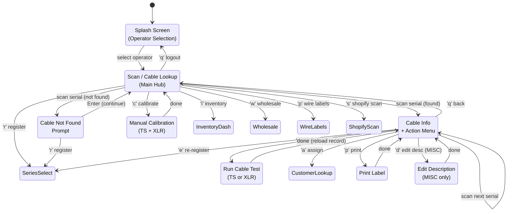
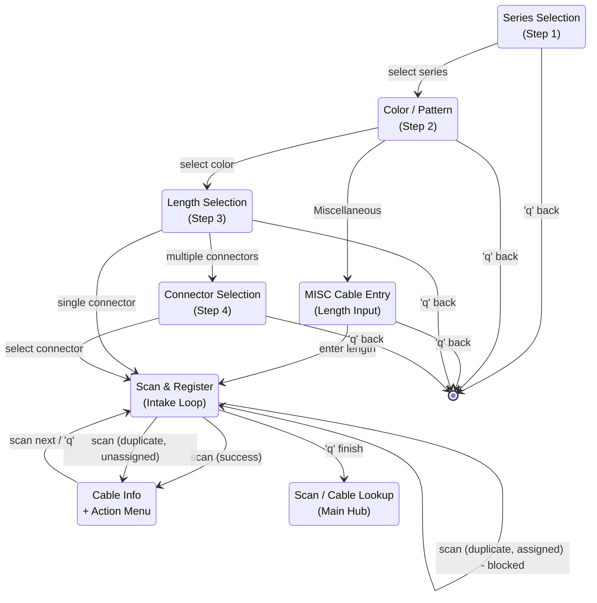
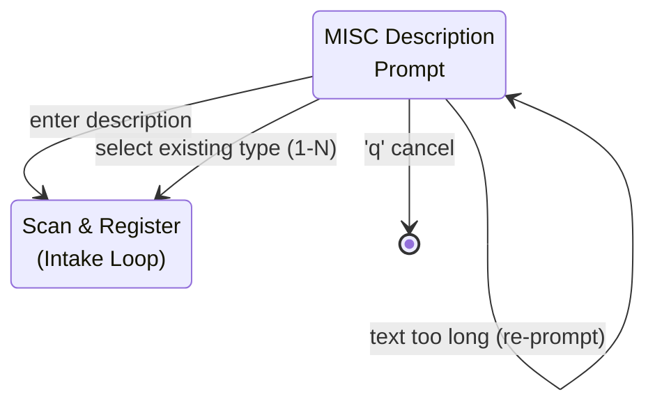
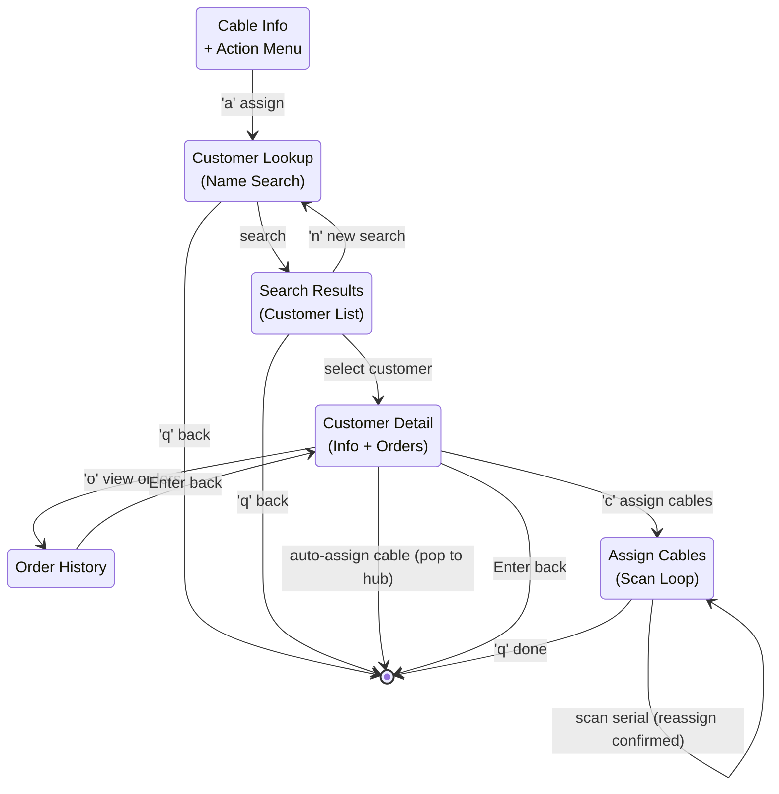
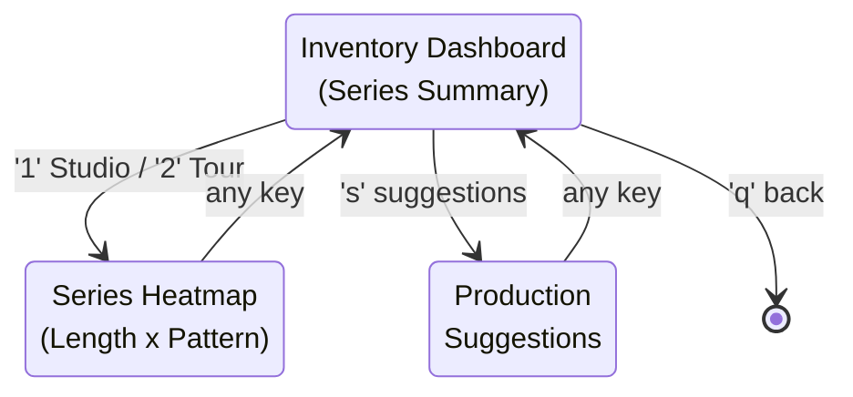
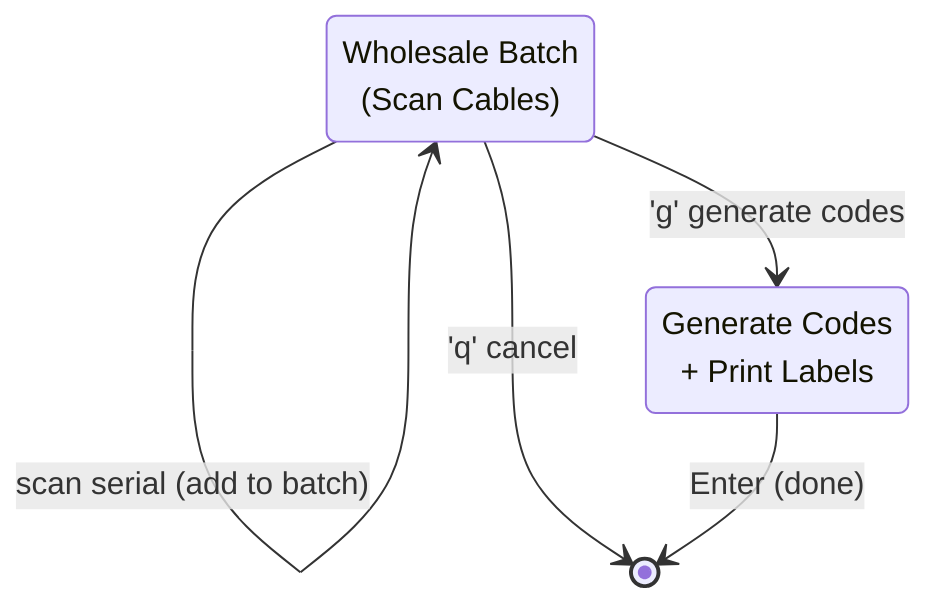
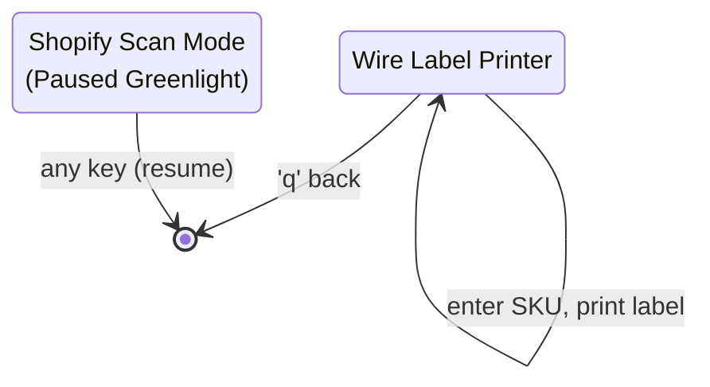
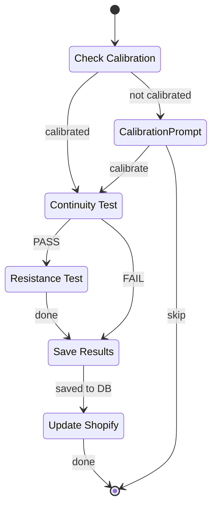
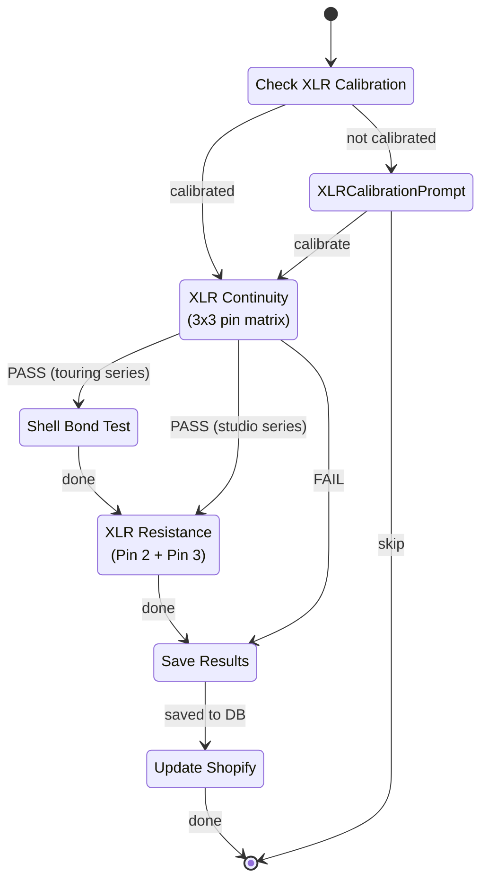

# Greenlight UI Flow Map

Complete state diagram of every screen and transition in the Greenlight application.

## Main Flow

## Cable Registration Flow

## MISC Cable Description Sub-flow

## Customer & Assignment Flow

## Inventory Flow

## Wholesale Flow

## Utility Screens

## Cable Test Detail (TS)

## Cable Test Detail (XLR)

## External Dependencies

| Action | System | Screens |
|--------|--------|---------|
| Register cable | PostgreSQL | Intake |
| Save test results | PostgreSQL | Cable Test |
| Assign to customer | PostgreSQL | Assign Cables, Customer Detail |
| Update description | PostgreSQL + Shopify | Edit Description |
| Set inventory | Shopify API | Cable Test (on pass) |
| Create MISC product | Shopify API | Intake (MISC cables) |
| Customer search | Shopify API | Customer Lookup |
| Customer orders | Shopify API | Customer Detail, Orders |
| Wire product lookup | Shopify API | Wire Labels |
| Run continuity test | Arduino | Cable Test |
| Run resistance test | Arduino | Cable Test |
| Run shell bond test | Arduino | Cable Test (XLR) |
| Calibrate tester | Arduino | Calibration |
| Print cable label | TSC Printer | Print Label, Cable Test (auto) |
| Print wire label | TSC Printer | Wire Labels |
| Print reg code label | TSC Printer | Wholesale |
| Scan barcode | Zebra DS2208 | Hub, Intake, Assign, Wholesale |
| Webhook control | MQTT | Shopify Scan Mode |
